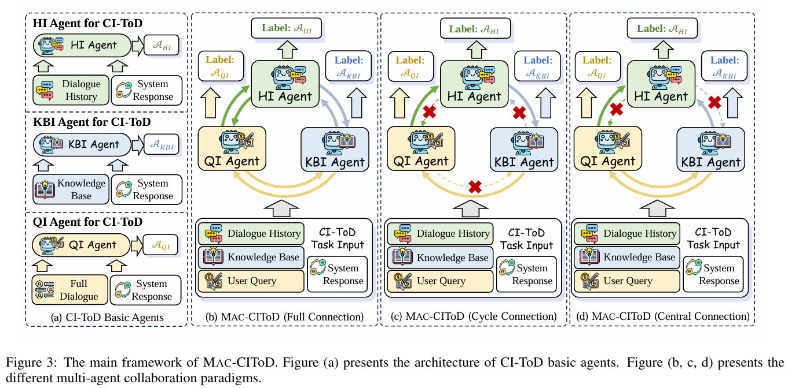
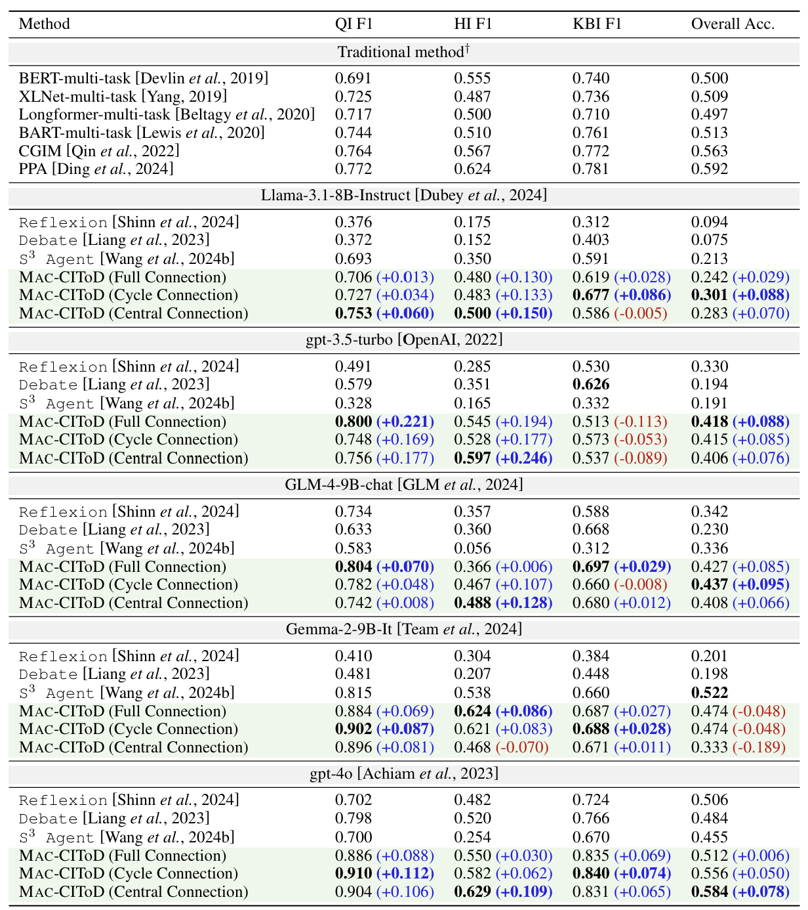

<h2 align="center">Improving Consistency Identification in Task-oriented Dialogue through Multi-Agent Collaboration</h2>

<p align="center">
  <b>
  [<a href="https://doi.org/10.24963/ijcai.2025/918">Paper</a>]
  </b>
  <br/>
</p>

### Table of Contents
- [MAC-CIToD](#mac-citod)
- [Setup](#setup)
- [Performance](#performance)
- [Reference](#reference)
- [Contact](#contact)

## MAC-CIToD


## Setup
1. Create conda environment:
```bash
conda create -n mac_citod python=3.10
conda activate mac_citod
```

2. Install environment:
```bash
pip install openai tqdm scikit-learn
```

3. (Optional) If you want to run a model based on the API platform, please configure the API key of the corresponding platform in `model.py`:
```python
# openai, including gpt-3.5-turbo, gpt-4o
--> client_gpt = OpenAI(api_key="openai api key", base_url="https://api.openai.com/v1")

# deepinfra, including llama-3.1, gemma-2, 
--> client_deepinfra = OpenAI(api_key="deepinfra api key", base_url="https://api.deepinfra.com/v1/openai")
```

4. (Optional) If you want to run the model locally, please configure the environment and modify the code in `main.py` and `os_model.py` as required:

4.1 Install the required packages:
```bash
pip install transformers vllm
```

4.2 In `main.py`, replace the generator assignment:
```python
elif args.model_name == 'llama':
    # eval_model = model('meta-llama/Meta-Llama-3.1-8B-Instruct')
    # generator = eval_model.deepinfra_generator
--> generator = os_model.llama3_generator # use generator from os_model.py instead of model.py
```
4.3 In `os_model.py`, set `model_name` to your local model path:
```python
def llama3_generator(...):
    ...
--> model_name = "model_path" # replace it with your local model path
    ...
```
>PS: for the GLM4 model, DeepInfra does not currently support providing a GLM4 API. You will need to download it yourself from websites such as Hugging Face or ModelScope. On Hugging Face, the model is named `THUDM/glm-4-9b-chat`.

5. Run our code:
```bash
python main.py --connection CONNECTION --model_name MODEL_NAME

CONNECTION = ['full', 'cycle', 'central']
MODEL_NAME = ['gpt-3.5-turbo', 'gpt-4o', 'llama', 'glm4', 'gemma']
```

6. Output final evaluation. After the run is completed, the evaluation code will be run and the corresponding metrics will be output:
```json
{
    "first_round_eval": {
        "precision_qi": 1.0,
        "precision_hi": 1.0,
        "precision_kbi": 1.0,
        "recall_qi": 1.0,
        "recall_hi": 1.0,
        "recall_kbi": 1.0,
        "f1_qi": 1.0,
        "f1_hi": 1.0,
        "f1_kbi": 1.0,
        "overall_acc": 1.0
    },
    "second_round_eval": {
        "precision_qi": 1.0,
        "precision_hi": 1.0,
        "precision_kbi": 1.0,
        "recall_qi": 1.0,
        "recall_hi": 1.0,
        "recall_kbi": 1.0,
        "f1_qi": 1.0,
        "f1_hi": 1.0,
        "f1_kbi": 1.0,
        "overall_acc": 1.0
    }
}
```
In addition, you can get output log in `./log/MODEL_NAME/output_CONNECTION.json`.

## Performance


## Reference
If you find this project useful for your research, please consider citing the following paper:
```
@inproceedings{ijcai2025p918,
  title     = {Improving Consistency Identification in Task-oriented Dialogue Through Multi-Agent Collaboration},
  author    = {Wang, Peng and Li, Shuo and Zhou, Ruoxi and Chen, Qiguang and Xu, Xiao and Fei, Hao and Li, Dagang and Che, Wanxiang and Qin, Libo},
  booktitle = {Proceedings of the Thirty-Fourth International Joint Conference on
               Artificial Intelligence, {IJCAI-25}},
  publisher = {International Joint Conferences on Artificial Intelligence Organization},
  editor    = {James Kwok},
  pages     = {8259--8267},
  year      = {2025},
  month     = {8},
  note      = {Main Track},
  doi       = {10.24963/ijcai.2025/918},
  url       = {https://doi.org/10.24963/ijcai.2025/918},
}
```

## Contact
If you have any questions or suggestions, please create Github issues here or email [Peng Wang](mailto:wpengxss@gmail.com), and [Libo Qin](mailto:lbqin@csu.edu.cn).
